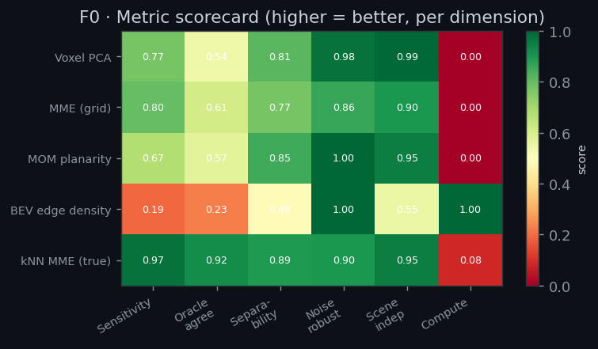
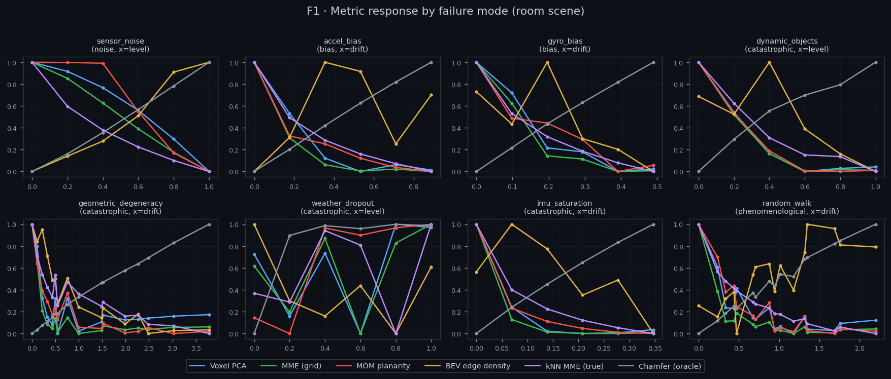
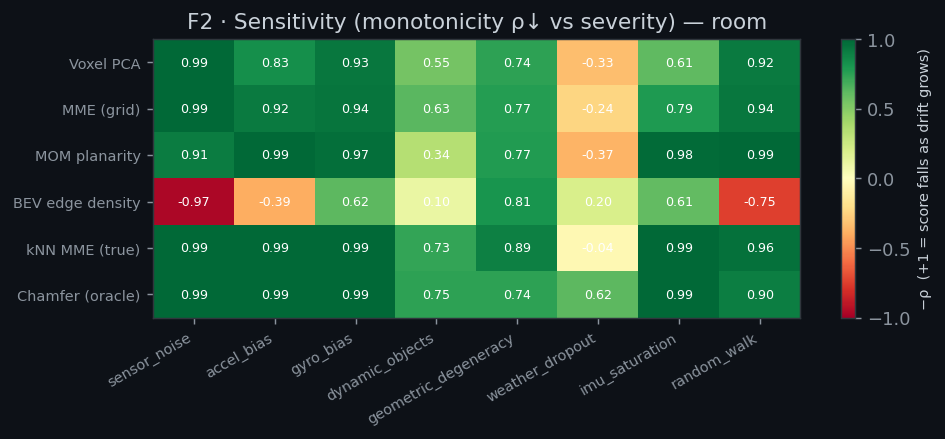
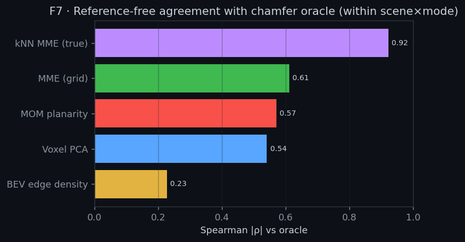
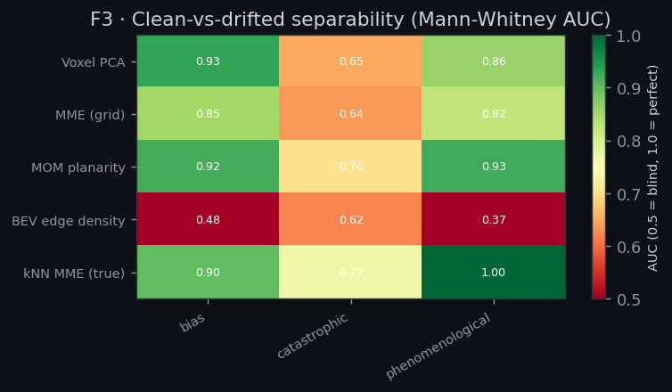
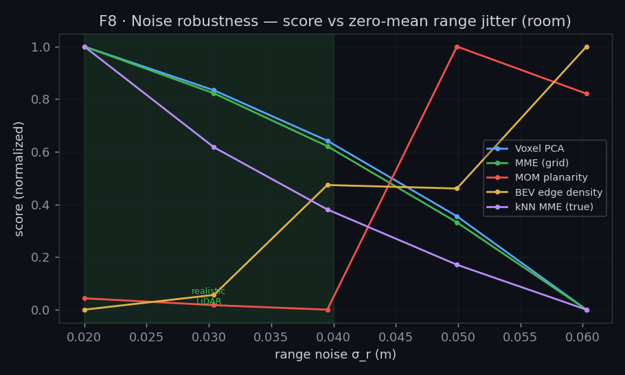
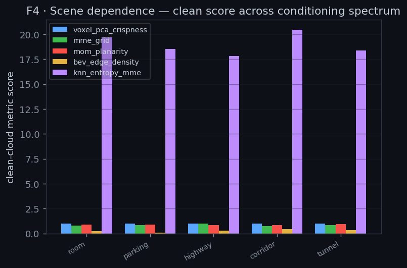
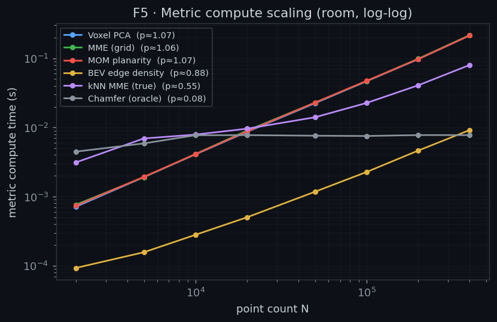
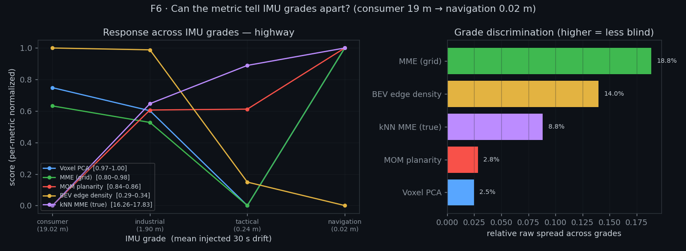

# Results — Synthetic Drift Benchmark

**Author:** Zephyr Feng · **Date:** 2026-06-23 · Generated by `experiments/run_all.py`

Methods and physical grounding: [methods.md](methods.md). All numbers below are
means over 3 seeds; figures are in [`../figures/`](../figures).

> **Read this first.** Absolute metric values are simulator-specific; the
> findings that transfer to real data are the **rank-based comparisons** between
> metrics and the **qualitative blind-spots**. This is a metric-selection tool,
> not a calibrated drift estimator.

---

## 0. Scorecard (the bottom line)

| Metric | Sensitivity | Oracle agree¹ | Separability | Noise robust | Scene indep. | Time @400k | Scaling |
|---|---|---|---|---|---|---|---|
| **kNN MME (true)** | **0.98** | **0.92** | **0.89** | 0.90 | 0.95 | **80 ms** | O(N log N)² |
| Voxel PCA | 0.77 | 0.54 | 0.81 | 0.98 | **0.99** | 214 ms | O(N log N)* |
| MME (grid) | 0.80 | 0.61 | 0.77 | 0.86 | 0.90 | 216 ms | O(N log N)* |
| MOM planarity | 0.67 | 0.57 | 0.85 | **1.00** | 0.95 | 214 ms | O(N log N)* |
| BEV edge density | 0.19 | 0.23 | 0.49 | **1.00** | 0.55 | **9 ms** | O(N) |

¹ *Oracle agreement* = mean within-(scene, mode) Spearman with the chamfer
oracle (i.e. "given the scene, does the metric track true drift"). The naive
*pooled-across-scenes* number is far lower (voxel-PCA ≈ 0.05) because the same
score maps to very different true drift in different scenes — which is itself the
scene-dependence finding (§3, §6).

² kNN MME: O(N log N) tree construction + O(Q log N) queries, but Q is capped at
4000 regardless of N — so query cost is O(4000 · log N), not O(N · log N). This
is why it runs **faster than the voxel family at 400k** despite the same
asymptotic class: measured exponent ≈ 0.55 (sublinear at AV scale).

\* Voxel PCA / MME grid / MOM planarity are technically O(N log N) — `np.unique`
and `np.argsort` on the voxel key array both sort N elements. The measured
exponent is ≈ 1.07 (nearly linear) because log N is absorbed into the constant
at typical point-cloud sizes. The "O(N)" label in the original code docstring is
a practical simplification, not the strict bound.

**Headline:** **kNN MME (true Mean Map Entropy) is the most faithful candidate**
on every accuracy axis, at competitive compute. **Voxel-PCA — the original
primary candidate — is accurate in well-conditioned scenes but has a real
geometric-degeneracy blind spot** that the other voxel/grid metrics share.

---

## 1. Sensitivity & oracle agreement (exp01)

- **All voxel/grid metrics fall monotonically with bias-tier drift** (accel/gyro
  bias), confirming the research thesis: systematic bias smears surfaces and
  crispness sees it. kNN MME has the cleanest monotonic response (0.98).
- **kNN MME tracks the chamfer oracle far better than any other** reference-free
  metric (within-scene ρ ≈ 0.92 vs 0.54–0.61 for the voxel/grid family). It is
  the only candidate that reliably measures *true* drift rather than a
  surface-shape proxy.
- **Dynamic objects are nearly invisible to every reference-free metric.** Ghost
  trails add a small fraction of off-surface points that the voxel statistics
  average away; only the oracle (and weakly kNN MME) register them. Consistent
  with the research: dynamic contamination needs *removal*, not a crispness
  guard.

---

## 2. Separability & noise robustness (exp02)

- **Clean-vs-drifted separation is strong for the bias and catastrophic tiers**
  (AUC ≈ 0.8–0.95 for kNN MME / Voxel PCA / MOM), weak for BEV edge density
  (≈ 0.49 — no better than chance on some tiers).
- **At realistic LiDAR noise (σ_r ≤ 0.06 m) every candidate is robust**
  (robustness ≥ 0.86; MOM and BEV essentially flat). The metrics only start to
  erode above ~0.1 m range noise — far past real mechanical-LiDAR jitter. This
  validates the research claim that **zero-mean noise is benign** to crispness,
  *provided thresholds are set for the realistic regime.*

---

## 3. Scene dependence (exp03)

- **Voxel PCA is the most scene-invariant** clean-score (0.99): a clean map reads
  ≈ 0.98 whether room, highway, or tunnel — so a single clean baseline is
  defensible.
- **BEV edge density is strongly scene-dependent** (0.55): its clean score swings
  with scene geometry, so it would need scene-conditional thresholds.
- Caveat: clean-score invariance is *not* the same as drift-response invariance —
  see §6.

---

## 4. Compute (exp04)

- The voxel/grid family (Voxel PCA, MME grid, MOM) is technically **O(N log N)**
  — dominated by `np.unique` + `np.argsort` on voxel keys. The measured exponent
  is ≈ 1.06–1.07 (nearly linear at AV scale, ~0.5 µs/point → ~214 ms @400k),
  because log N is absorbed into the constant. The per-point outer product
  materialisation (`N × 9` array) is the actual runtime bottleneck.
- **kNN MME runs faster (80 ms) than the voxel family (214 ms) despite the same
  O(N log N) class** — because queries are capped at 4000 points regardless of
  N, so query cost is O(4000 · log N) not O(N · log N). Tree construction (the
  only N-scaling term) is a highly optimised C extension with a small constant.
- **BEV edge density is ~23× cheaper** (9 ms, exponent ≈ 0.88) — grid capped at
  1024 × 1024 makes it sub-O(N) above that density.
- All candidates are within a per-segment backfill budget at 400k points; the
  binding question is total corpus size, not per-segment cost.

---

## 5. IMU-grade response (exp05)

The open question from research-imu-grades — *graceful degradation or cliff?* —
answered on the feature-sparse **highway** scene, injecting each grade's
calibrated unaided 30 s drift (consumer ≈ 19 m → navigation ≈ 0.02 m, an 800×
range):

- **Voxel PCA and MOM are blind here** — both read essentially flat across all
  grades (raw spread ~2.5% / ~2.8%), including the 19 m consumer-grade
  catastrophe. Planarity-based metrics cannot see it.
- **MME-grid and BEV move (raw spread ~19% / ~14%) but *non-monotonically*** —
  spread is not the same as faithful tracking; their grade order is scrambled.
- **Only kNN MME rises monotonically consumer→navigation**, tracking the
  oracle's consumer→industrial cliff. It is the single candidate that both moves
  *and* moves in the right order in this degenerate scene.
- This is the §6 blind-spot in another guise: along-track drift on a feature-
  sparse highway slides points *along* the ground plane, preserving local
  planarity.

---

## 6. The central finding — the geometric-degeneracy blind spot

The same `gyro_bias` drift (0.49 m RMS pose error), in three scenes:

| Scene | true drift | Δ Voxel-PCA | Δ Chamfer (oracle) | interpretation |
|---|---|---|---|---|
| room | 0.49 m | **−0.109** | +0.055 | crispness sees it |
| highway | 0.49 m | −0.024 | +0.027 | weak |
| tunnel | 0.49 m | −0.066 | **+0.194** | crispness under-reports a 3.5× larger true error |

In degenerate/feature-sparse scenes, drift along the unconstrained axis moves
points *along* their surface — the surface stays locally planar, so voxel-PCA
planarity barely changes even as true error explodes. This is the synthetic
reproduction of the research-failure-modes §1 degeneracy result, and it is the
**most important caveat for the production metric**: a planarity-based crispness
score will systematically *miss* the tunnel/highway drift that the project most
needs to catch.

---

## 7. Recommendations for the metric decision (PLAN Week 1)

1. **Promote kNN MME (true) to co-primary candidate.** It dominates on accuracy
   and oracle agreement and is the only metric that survives the degeneracy and
   IMU-grade tests, at competitive compute. The original plan treated it as a
   "too slow" reference; the fixed-query-budget implementation here makes it
   practical — worth profiling at real backfill scale before deciding.
2. **Keep Voxel PCA, but pair it with a degeneracy guard.** It is cheap-ish,
   noise-robust, and scene-invariant on clean maps — good for the *common*
   bias-tier case — but cannot stand alone given the tunnel/highway blind spot.
   Combine with Qiaojun's INS-trajectory metric (which is exactly strong where
   crispness is blind) rather than duplicating coverage.
3. **Use scene-conditional thresholds**, or condition on a degeneracy indicator
   (e.g. the scene's dominant-eigenvector spread): a single global threshold
   inherits the blind spot.
4. **Demote BEV edge density to an optional cheap pre-filter** — too weak on
   sensitivity/separability and too scene-dependent to be primary.
5. **Do not rely on any reference-free crispness metric for dynamic-object
   contamination** — route that to dynamic-removal, not the crispness guard.

### Open items to carry into real-data validation (Week 2–3)
- Confirm the kNN-MME compute story at 10⁶–10⁸ points on real segments.
- Measure the real-data degeneracy blind-spot on the trigger run
  `rog115_20250721_003445` (a v3.1 case Sean flagged) — does kNN MME catch what
  voxel-PCA misses?
- Calibrate thresholds against the realistic σ_r of the production LiDAR.
