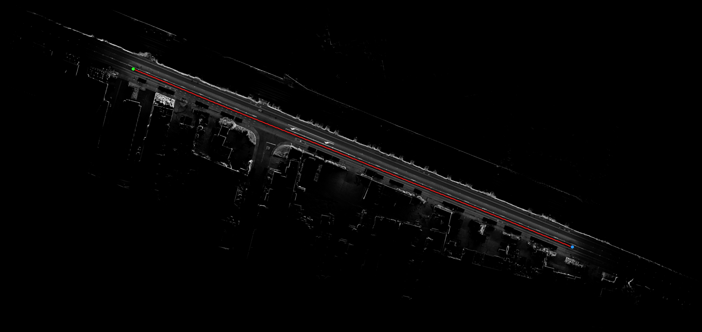
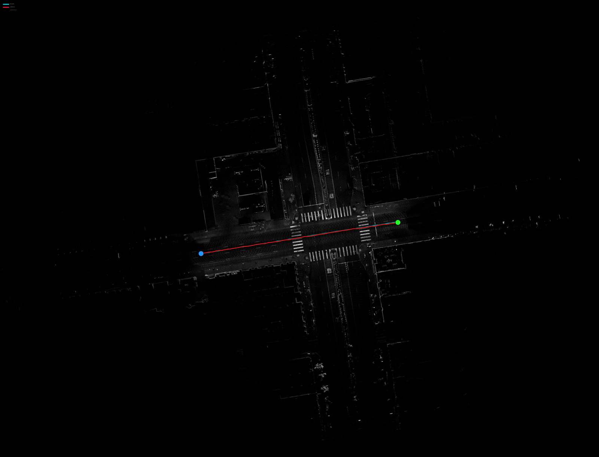
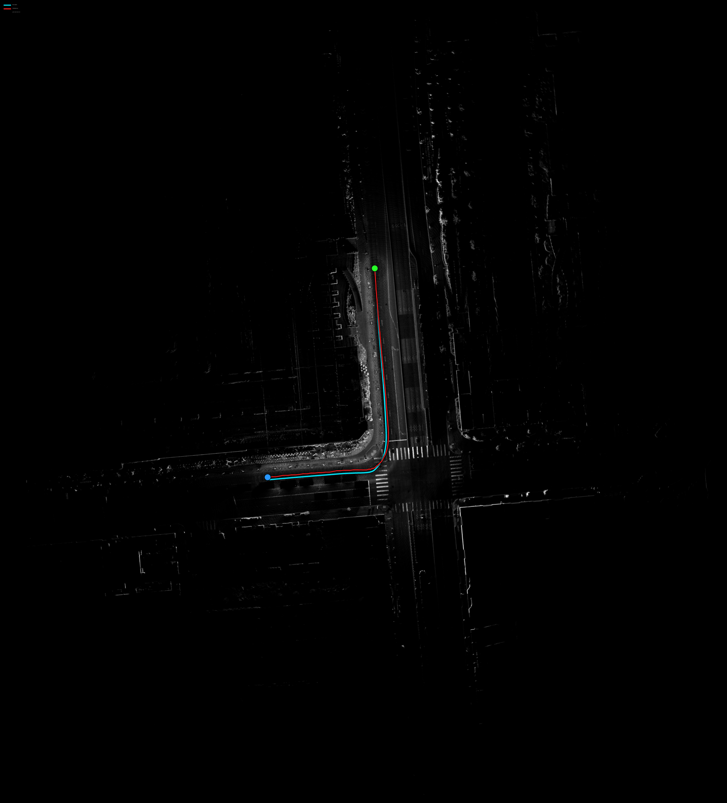
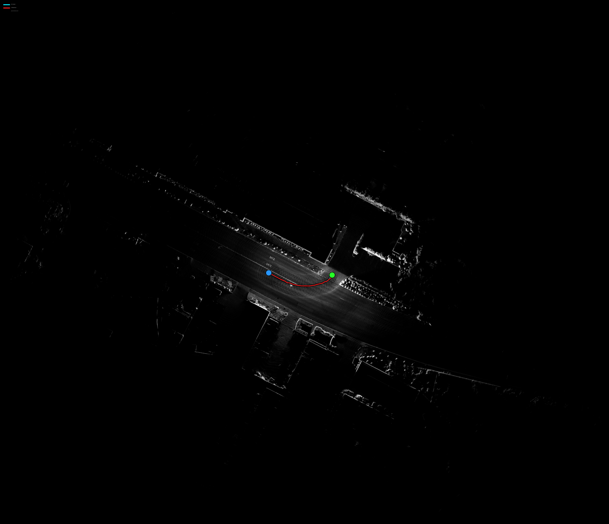
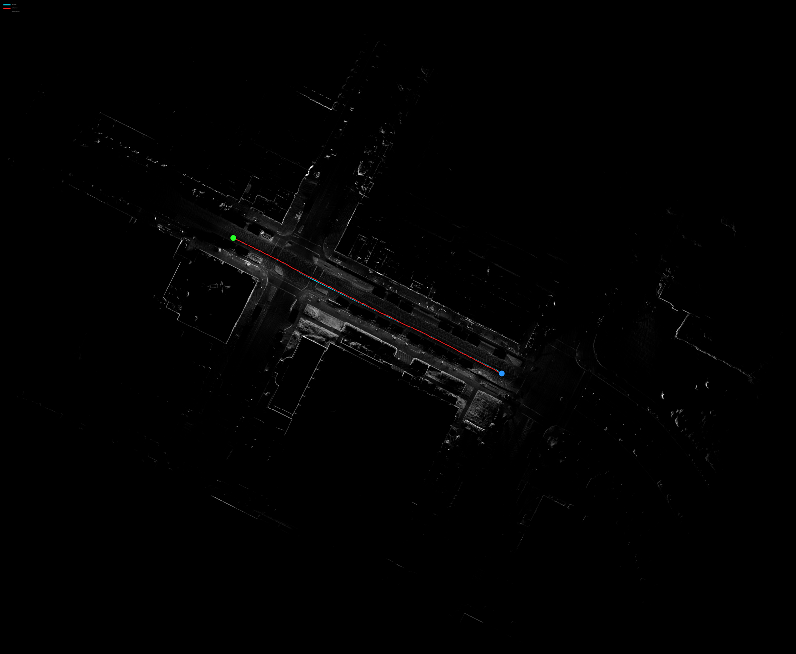
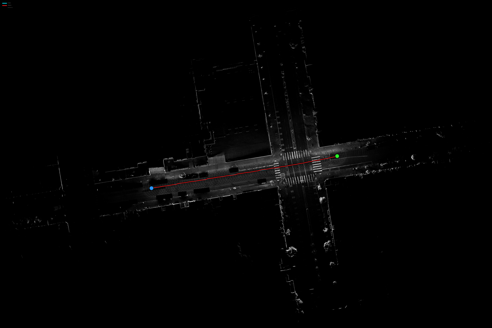
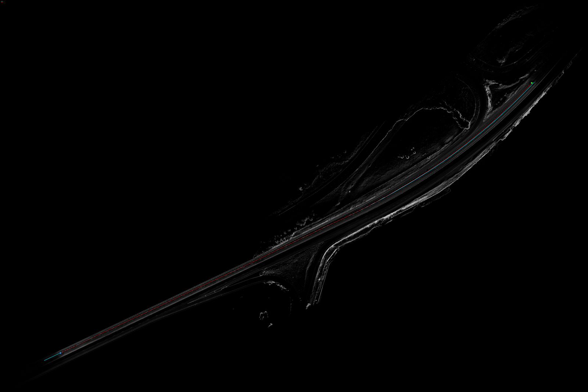

# SLAM Quality Failures — Offboard Re-analysis

**Date:** 2026-06-25
**Source list:** [Slam Quality Failures](https://appliedintuition.atlassian.net/wiki/spaces/DMP/pages/2780561807/Slam+Quality+Failures) (DMP space)
**Toolchain:** `onroad/lidar_slam/system` offboard mapping & localization (see the `onroad-slam-offboard-mapping` skill)

---

## 1. Executive summary

Seven runs that the **onboard** pipeline flagged for SLAM pose problems (lateral drift, position
jumps, or high training loss) were re-processed through the **offboard** lidar-SLAM toolchain,
which re-solves the trajectory with loop closure + pose-graph optimization. For each run we built
the accumulated intensity map, graded its self-consistency, and overlaid the optimized SLAM
trajectory (red) against the raw INS/onboard trajectory (cyan).

**Headline finding: 6 of the 7 flagged runs are cleanly resolved offboard** — the reconstructed
maps are crisp (0 abnormal keyframes) and the optimized trajectory agrees with INS to within
~1.5 m. Because this tool re-derives everything from the **raw URSA log** (see §3), and both the
raw recorded `/localization` and our independent SLAM come out clean, the drift/jumps seen in the
pipeline's exports must have been **introduced downstream in the offboard data-ingestion /
auto-labeling pipeline**, not in the raw sensor data or the achievable offline solution. This
matches the working hypothesis that the failures originate in our offboard pipeline.

**The one genuine, unresolved failure is `rog115_20250721_003445` (the "high-loss" scenario):**
21 abnormal keyframes (7.0%) and up to **27.85 m** of INS-vs-optimized divergence, with a visibly
**smeared/ghosted** map. This run should be the priority for root-cause investigation.

---

## 2. Method & how to read the images

Pipeline per run (30 s window, drive-id + start/end epoch from the export name):

1. `onroad_lidar_slam_runner` — reconstruct keyframe clouds + pose-graph-optimized poses.
2. `build_pointcloud_map` — accumulate; emit `trajectory.pcd` (optimized path, UTM).
3. `build_pointcloud_map_tiles` — top-down intensity tiles (the map background).
4. `map_quality_check_fitness_score` — grade map self-consistency.
5. Overlay both trajectories on the stitched intensity map.

**Reading each figure:**
- **Background (grayscale):** accumulated lidar **intensity**, top-down. Sharp, single-edged
  structures (lane lines, curbs, building walls, crosswalks) = **crisp** = good pose consistency.
  Doubled / smeared / swirled structure = **fuzzy** = pose inconsistency.
- **Red line:** offboard **SLAM-optimized** ego trajectory.
- **Cyan line:** raw **INS / onboard** trajectory.
- **Green dot:** start. **Blue dot:** end.
- Where red sits exactly on cyan, the two solutions agree. Visible cyan/red separation =
  divergence between the offline solution and the onboard INS.

**Metrics:**
- **Abnormal keyframes** — keyframes whose neighbor-alignment sqrt-fitness-score exceeds 0.4 m
  RMSE. This is an *independent* crispness measure (does not depend on INS). 0 = crisp everywhere.
- **INS↔opt gap** — nearest-neighbor lateral distance (meters) between the INS and optimized
  trajectories: mean and max over the window.

**Caveat (important for interpretation):** the runner was launched with INS prior factors
(`use_ins_prior=true`), so the optimized trajectory is *anchored* to INS — small gaps are partly
expected by construction. The **abnormal-keyframe** count is therefore the more trustworthy,
independent signal of whether the offline map itself is sound. A run with both a large gap *and*
abnormal keyframes (only `rog115_jul` here) is an unambiguous failure.

---

## 3. Where the tool reads its data from (why this is a valid control)

This is central to interpreting the results, because it determines what the analysis can and
cannot attribute a failure to.

**The tool reads raw recorded sensor data straight from the URSA log — nothing from the
auto-labeling pipeline.** The runner builds its input via `OnroadDataProvider::from_ursa(run_uuid,
…)` (`lidar_slam/system/onroad_data_provider.cc`), which wraps `UrsaMessageSource::Make(run_uuid,
time_bounds)` and **streams** messages from the recorded URSA log over gRPC
(`grpc.neuron.oci.applied.dev`) + S3 blob storage (`ursa-neuron-prod-structured-log-blob-messages`,
OCI; authenticated with the `oci` AWS profile + the URSA gRPC token). It does **not** download an
MCAP and does **not** consume any product of the offboard pipeline.

Concretely, per run it pulls only:
- **Lidar** — the motion-compensated front Hesai point cloud
  (`/sensors/lidar/front_center/points_motion_compensated`, a `HesaiRangeImageBundle` proto), ~10 Hz.
- **INS / ego-pose** — the recorded onboard navigation pose stream `/localization` (configurable
  alternatives `/swiftnav/gps_output`, `/sensors/ins/ublox/pvat`), ~100 Hz. This is exactly what the
  figures label "INS / onboard" (cyan) and what is written verbatim to `ground_truth/poses.tum`.
- **Calibration** — the extrinsics embedded in the URSA log (fallback `config/calibration/<vehicle>`).

It then **re-derives the trajectory and map from scratch** (lidar odometry + pose-graph
optimization, using `/localization` only as an INS prior). The "SLAM optimized" path (red) and the
accumulated intensity map are computed here, independently of any pipeline output.

**Data lineage:**

```
                                          ┌─► THIS TOOL: re-run SLAM from raw data ─► red path + map (this report)
 vehicle ─► URSA recorded log             │
           (raw lidar, /localization,     │
            calibration)                  └─► offboard data-ingestion + auto-labeling pipeline
                                              (data QC, frame extraction, SLAM/pose stage,
                                               calibration, export) ─► drift/jump observed here
```

Both branches start from the **same raw URSA inputs**; the tool just branches off earlier, before
any pipeline processing.

**Why that matters for the verdicts.** Because the tool re-derives everything from the raw inputs,
a clean offboard result means the *raw inputs are good*, so any failure seen in the pipeline's
export must have been *introduced by the pipeline*. For 6 of the 7 runs, **both** the recorded
`/localization` (cyan) **and** the independently-optimized SLAM (red) are clean and mutually
consistent (≤1.5 m, 0 abnormal keyframes) — yet the pipeline's export of those same windows showed
drift/jumps. The only place that error can have entered is **downstream, in the offboard
data-ingestion / auto-labeling pipeline** — e.g. its own SLAM/pose stage, a calibration or
frame-timing step, or a coordinate transform applied during export. This matches the working
hypothesis: those failures are pipeline-introduced, not sensor- or raw-data-level.

**The exception is `rog115_20250721` (high-loss).** Here the failure *does* reproduce from raw
data: the recorded `/localization` (cyan) and the independent SLAM (red) disagree by up to 28 m and
the map is fuzzy (21 abnormal keyframes). Because it reproduces in an independent re-derivation from
the raw URSA log, this one is **not** merely a pipeline artifact — it reflects a genuinely hard
window (degraded `/localization`/GNSS, sparse or degenerate geometry, or fast motion) that SLAM
itself cannot resolve. That is consistent with it being surfaced by high-loss debugging rather than
by a human spotting a drift/jump.

---

## 4. Results summary

| Run | Date | Reported issue | Keyframes | Abnormal kf | INS↔opt gap mean / max | Verdict |
|---|---|---|---:|---:|---:|---|
| rog201_20251117 | Nov 2025 | ~10 m lateral drift / 8 s | 299 | 0 (0.0%) | 0.50 / 0.96 m | Resolved — crisp |
| rog115_20251119 | Nov 2025 | 2 m jump / 0.5 s | 79 | 0 (0.0%) | 0.39 / 0.75 m | Resolved — crisp |
| rog138_20250813 | Aug 2025 | pose drift | 108 | 0 (0.0%) | 0.65 / 1.48 m | Resolved — crisp |
| rog122_20250519 | May 2025 | pose drift (same as above) | 35 | 0 (0.0%) | 0.59 / 0.75 m | Resolved — crisp |
| rog121_20251028 | Oct 2025 | similar jump | 92 | 0 (0.0%) | 0.35 / 1.24 m | Resolved — crisp |
| rog118_20251012 | Oct 2025 | similar jump | 83 | 0 (0.0%) | 0.43 / 0.87 m | Resolved — crisp |
| **rog115_20250721** | **Jul 2025** | **high-loss debugging** | **300** | **21 (7.0%)** | **1.41 / 27.85 m** | **FAILURE — smeared/divergent** |

Full-resolution overlays are in `images/<name>_full.png`; previews referenced below.

---

## 5. Per-scenario analysis

### 4.1 rog201_20251117_220804 — reported ~10 m lateral drift over 8 s  ✅ resolved



Straight multi-lane arterial. The map is crisp: legible painted turn arrows, lane numbers, and
sharp dashed/solid lane lines (the faint concentric arcs are the Hesai scan-ring pattern, not
blur). Red and cyan are coincident the full length (max gap 0.96 m), and 0/299 keyframes are
abnormal. The onboard "10 m drift" does **not** reproduce offboard — the offline pose-graph
solution is clean and in-lane.

### 4.2 rog115_20251119_233927 — reported 2 m jump in 0.5 s  ✅ resolved



Straight crossing of a wide 4-way signalized intersection (crosswalk stripes and stop bars are
sharp). The trajectory passes straight through; red overlays cyan with no visible jump (max gap
0.75 m), 0 abnormal keyframes. The reported 0.5 s jump is not present in the offboard
reconstruction.

### 4.3 rog138_20250813_221025 — reported pose drift  ✅ resolved



A 90° right turn at an intersection. Intersection geometry, crosswalks, and adjacent building
edges are crisp. Both trajectories follow the turn together; this run shows the largest gap among
the clean set (1.48 m max) — a slight, smooth cyan/red separation through the curve — but the map
remains fully consistent (0 abnormal keyframes). Resolved.

### 4.4 rog122_20250519_143307 — "same exact issue" as rog138  ✅ resolved



Short gently-curving segment (only 35 keyframes — slow/short window). Road surface and roadside
structure are crisp; red tracks cyan closely (max gap 0.75 m), 0 abnormal keyframes. Consistent
with rog138 — resolved offboard. (Oldest run in the set, May 2025; data still fully accessible.)

### 4.5 rog121_20251028_144840 — similar jump  ✅ resolved



Straight pass through an intersection (dimmer scene — lower-reflectivity surroundings). Structure
is crisp where present; trajectories coincide (max gap 1.24 m), 0 abnormal keyframes. Resolved.

### 4.6 rog118_20251012_151849 — similar jump  ✅ resolved



Straight crossing of a 4-way intersection with clear crosswalks and lane markings. Crisp map,
coincident trajectories (max gap 0.87 m), 0 abnormal keyframes. Resolved.

### 4.7 rog115_20250721_003445 — high-loss debugging scenario  ❌ FAILURE



**This is the only genuine offboard failure.** The map is visibly **smeared and ghosted** — note
the large swirl/blur toward the upper portion of the track and the lack of sharp structure — and
the cyan (INS) and red (optimized) trajectories **visibly separate**. Quantitatively: **21 of 300
keyframes are abnormal (7.0%)** and the INS↔optimized gap reaches **27.85 m** (mean 1.41 m). This
window had the most keyframes (300, hitting the cap) over a fast/long trajectory.

Unlike the other six, the failure here is **not** explained away as a downstream pipeline artifact
(§3): the offline pose-graph optimization, re-run from the raw URSA log, itself cannot produce a
self-consistent map, and it diverges tens of meters from the recorded `/localization`. This matches
its origin — it was surfaced by **high-loss debugging** (a model-training signal) rather than a
human eyeballing a drift/jump, i.e. a harder, real failure rooted in the raw window itself.

---

## 6. Conclusions & recommendations

1. **Offboard re-processing resolves 6 of 7 flagged runs.** Crisp maps + ≤1.5 m INS agreement +
   0 abnormal keyframes — derived independently from the raw URSA log (§3) — indicate the
   drift/jumps were **introduced by the offboard data-ingestion / auto-labeling pipeline**, not by
   the raw sensors or the achievable solution. The investigation should focus on the pipeline
   stages between raw-log ingestion and export (its SLAM/pose stage, calibration/frame-timing, and
   export coordinate transforms).
2. **`rog115_20250721_003445` is the priority.** It is the only run with a genuine offboard
   mapping failure (7% abnormal keyframes, ~28 m divergence, visibly fuzzy map). Recommend deeper
   investigation: inspect its `abnormal_keyframe_visualization/`, try `offline_map_refinement`
   (add loop-closure edges), and check for degenerate geometry / fast motion / poor INS in the
   window.
3. **Caveat to carry forward:** because `use_ins_prior=true`, the optimized-vs-INS agreement on the
   clean runs partly reflects anchoring. To *prove* offline SLAM independently corrects the onboard
   error, the next step is to overlay the **pure lidar-odometry** path (`odometry/`, no pose-graph
   optimization) — that shows how much the optimization actually pulls in, independent of INS.

---

## 7. Reproduction

All artifacts under `outputs/lidar_slam_outputs/<run>/`. Batch driver:
`outputs/lidar_slam_outputs/_tools/run_batch.sh`; overlay tool:
`outputs/lidar_slam_outputs/_tools/plot_trajectory_on_map.py`. Per-run metrics in
`_tools/results.tsv` and each run's `traj_stats.json` / `fitness_score_results*.txtpb`.
See the `onroad-slam-offboard-mapping` skill for the environment/run recipe (oci profile,
run-from-runfiles, the DMP-6677 stale-binary fix).
